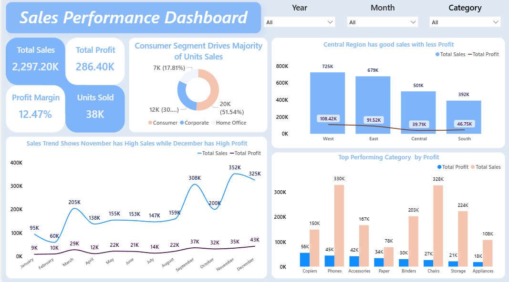

# Sales-Performance-Dashboard
Power BI Sales Performance Dashboard using DAX and business insights

# 📊 Sales Performance Dashboard – Power BI

## 📌 Project Overview
This project analyzes sales performance across regions, categories, segments, and time to help stakeholders understand revenue trends and profitability.

The dashboard is built using **Power BI Desktop** with a focus on **business insights, DAX calculations, and clean visual design**.

---

## 🎯 Business Objectives
- Track overall sales, profit, and profit margin
- Identify top-performing regions and categories
- Understand monthly sales and profit trends
- Analyze customer segments contributing to unit sales

---

## 📂 Dataset
- Source: kAGGLE / Public dataset
- Format: CSV / Excel
- Data includes:
  - Customer 
  - Date
  - Geography
  - Product
  - Sales

---

## 🛠 Tools & Skills Used
- Power BI Desktop
- Power Query (Data Cleaning)
- DAX (Measures & KPIs)
- Data Modeling
- Data Visualization & Storytelling

---

## 📐 Key KPIs
- Total Sales
- Total Profit
- Profit Margin %
- Units Sold

---

## 🧮 DAX Measures
```DAX
Total Sales = SUM(Sales[Sales])

Total Profit = SUM(Sales[Profit])

Profit Margin = DIVIDE([Total Profit],[Total Sales])

Units = SUM(Sales[Quantity])
```

---

## 📊 Dashboard Features

 - KPI cards for quick performance overview
 - Monthly sales & profit trend analysis
 - Regional sales vs profit comparison
 - Category-wise performance analysis
 - Segment contribution to unit sales
 - Interactive slicers (Year, Month, Category)

## 🔍 Key Insights

 - November shows the highest sales, while December has the highest profit
 - West region generates high sales but relatively lower profit margin
 - Consumer segment contributes the majority of unit sales
 - Phones and Chairs are top sales categories

---

📸 Dashboard Preview

See dashboard image below.



---

🚀 How to Use

 - Download the Sales-Performance-Dashboard.pbix file
 - Open in Power BI Desktop
 - Use slicers to explore insights

---
